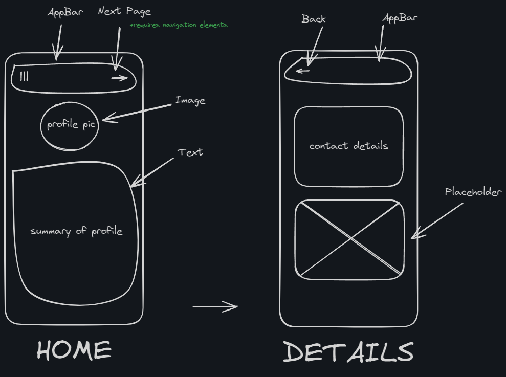

# portfolio

## Project 1

### Objective
General Flutter learning

### Focus 
UI

### Sub Focus 
Basic Widgets

### Description
This project utilizes basic widgets of Flutter to build a simple 2 page portfolio application. It will include a Scaffold, AppBar, Column, Row, Image, Text, Container, Placeholder, and CircleAvatar.

